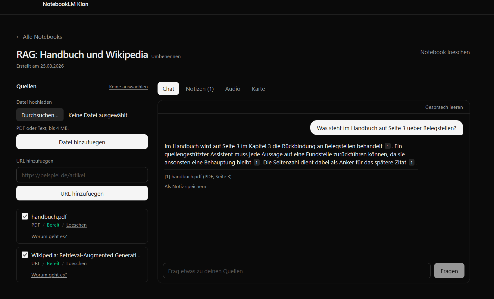

# NotebookLM Klon

Ein quellengestuetzter Recherche-Assistent nach Vorbild von Google NotebookLM.
Notebook anlegen, Quellen hochladen (PDF, Textdatei, URL), Fragen stellen —
**und jede Aussage der Antwort zurueckverfolgen bis zur Textstelle, aus der sie
stammt.**

**Live: https://notebooklm-klon-to-kar.vercel.app**



> Bewerbungsaufgabe. Der Fokus liegt auf dem Kern des Produkts und auf
> nachvollziehbaren Entscheidungen, nicht auf Funktionsfuelle.

> **Zur Live-Demo:** Notebooks, Quellen und gespeicherte Gespraeche lassen sich
> jederzeit ansehen. Das Stellen *neuer* Fragen haengt am kostenlosen
> Kontingent des Anbieters — **20 Anfragen pro Tag fuer das gesamte Projekt**.
> Ist es aufgebraucht, meldet der Chat das ausdruecklich, statt stumm zu
> scheitern. Wer die Antwortqualitaet selbst pruefen moechte, startet das
> Projekt am besten lokal mit einem eigenen Schluessel.

## Worum es geht

Der Wert von NotebookLM liegt nicht im Chat. Ein Chat ohne Belege ist ein
Sprachmodell mit Textfeld. Der Wert liegt darin, dass **jede Aussage aus deinen
Quellen belegt ist und du das nachpruefen kannst, ohne dem Modell zu glauben.**

Konkret heisst das hier:

- Die Antwort verweist mit `[1]`, `[2]` auf die Abschnitte, aus denen sie stammt.
- Ein Klick auf die Nummer oeffnet den **woertlichen Abschnitt** — nicht eine
  Zusammenfassung davon.
- Von dort fuehrt ein Link ins Original: bei PDFs direkt auf die richtige Seite,
  bei Web-Quellen auf die Seite.
- Findet die Suche nichts Passendes, wird das Modell **gar nicht erst gefragt**.
  Statt einer erfundenen Antwort kommt eine Absage.

Der letzte Punkt ist der wichtigste. Ein Assistent, der bei fehlendem Wissen
raet, ist schlimmer als keiner.

## Funktionsumfang

| Bereich | Was |
| --- | --- |
| Notebooks | anlegen, auflisten, oeffnen, loeschen |
| Quellen | PDF- und Textupload, URL-Eingabe, Statusanzeige, loeschen |
| Ingestion | Parsen, Chunking mit Herkunftsangabe, Embedding, Statuspflege |
| Chat | Retrieval, gestreamte Antwort, Folgefragen mit aufgeloesten Rueckbezuegen |
| Zitate | klickbare Verweise, woertlicher Abschnitt, Link ins Original |
| Verlauf | wird gespeichert, ueberlebt einen Reload, laesst sich leeren |

## Stack

- **Next.js** (App Router, TypeScript), Deployment auf Vercel
- **Supabase**: Postgres mit pgvector fuer die Vektorsuche, Storage fuer Dateien
- **Gemini** fuer Embeddings und Antworten — per Env austauschbar

Ein einziges Deploy-Ziel, eine echte Datenbank statt Attrappe.

## Datenfluss

```
Quelle hinzufuegen ──▶ Storage (privat)
        │
        ▼
  Ingestion: parsen ──▶ chunken ──▶ embedden ──▶ chunks (pgvector)
                          │
                          └─ jeder Chunk merkt sich Seite und Zeichenoffset

Frage ──▶ Rueckbezuege aufloesen ──▶ Vektorsuche ──▶ Kontext bauen
                                                        │
                                                        ▼
                                          Antwort streamen mit [n]
                                                        │
                                                        ▼
                                     Klick auf [n] ──▶ Abschnitt + Original
```

Die Herkunftsangabe im Chunk ist kein Beiwerk: ohne sie gaebe es keine
klickbaren Zitate und damit kein Produkt.

## Lokal starten

```bash
npm install
cp .env.example .env.local
```

**Migrationen anwenden** — alle fuenf, in dieser Reihenfolge, im
Supabase-SQL-Editor oder per CLI:

| Datei | Inhalt |
| --- | --- |
| `0001_init.sql` | Tabellen und `match_chunks` |
| `0002_grants.sql` | Rechte und RLS |
| `0003_sources.sql` | URL-Spalte, Constraint, Storage-Bucket |
| `0004_source_error.sql` | Fehlergrund einer Quelle |
| `0005_messages.sql` | Chatverlauf |

**Env-Variablen:**

| Variable | Woher |
| --- | --- |
| `NEXT_PUBLIC_SUPABASE_URL` | Supabase-Dashboard, Projektseite |
| `NEXT_PUBLIC_SUPABASE_PUBLISHABLE_KEY` | Settings ▸ API Keys ▸ Publishable |
| `SUPABASE_SECRET_KEY` | Settings ▸ API Keys ▸ Secret — **niemals in den Client** |
| `LLM_API_KEY` | [aistudio.google.com](https://aistudio.google.com/apikey) |
| `LLM_MODEL` | z. B. `gemini-3.5-flash` |
| `EMBEDDING_MODEL` | `gemini-embedding-001` |

```bash
npm run dev     # http://localhost:3000
npm test        # 135 Tests, unter einer Sekunde
npm run lint
npm run build
```

`http://localhost:3000/api/health` meldet, ob alle sechs Env-Variablen gesetzt
sind, und nennt die fehlenden beim Namen. Derselbe Endpunkt liegt auf der
Live-Demo unter `/api/health`.

> **Zur Embedding-Dimension:** `chunks.embedding` und die Signatur von
> `match_chunks` stehen auf 1536. Wer das Embedding-Modell wechselt, muss beide
> Stellen anpassen. `gemini-embedding-001` liefert auf Wunsch genau 1536, ein
> anderer Anbieter womoeglich nicht. Der Code prueft die Laenge und bricht ab,
> statt unbrauchbare Vektoren zu schreiben.

## Entscheidungen

Die ausfuehrlichen Begruendungen stehen in den Pull Requests. Die wichtigsten:

**Der Browser spricht nie mit Supabase.** Alle Zugriffe laufen serverseitig, der
Secret-Key bleibt auf dem Server. Rechte hat ausschliesslich `service_role`;
`anon` bekommt bewusst keine, obwohl der Publishable Key im Client-Bundle liegt.

**Ein Chunk gehoert immer zu genau einer Seite.** Ueber Seitengrenzen hinweg zu
buendeln waere effizienter, wuerde aber die Seitenzahl im Zitat zur Luege machen.

**Ohne tragfaehigen Kontext wird nicht gefragt.** Liegt der beste Treffer unter
einer Mindestaehnlichkeit, gibt es eine feste Absage statt eines LLM-Aufrufs.
Der Schwellwert stammt aus Messungen: passende Fragen erreichten 0,63 bis 0,83,
eine unpassende 0,50.

**Der Server ist die einzige Wahrheit ueber den Verlauf.** Der Browser schickt
nur die Frage. Sonst gaebe es zwei Fassungen davon, was gesagt wurde, und sie
liefen auseinander, sobald ein zweiter Tab offen ist.

**Belege werden als Momentaufnahme gespeichert**, nicht als Verweis auf `chunks`.
Ein Verweis ginge ins Leere, sobald die Quelle geloescht wird — die Antwort
beruhte aber nun einmal auf diesem Text.

**URL-Abruf mit Adresspruefung beim Verbindungsaufbau.** Ohne Auth kann jeder
eine Adresse hinterlegen, abgerufen wird sie vom Server. Den Hostnamen zu
pruefen genuegt nicht: ein unauffaelliger Name kann per DNS ins private Netz
zeigen. Erst aufzuloesen und dann abzurufen hat eine Luecke (DNS-Rebinding),
deshalb haengt die Pruefung in der `lookup`-Funktion und trifft die Adresse, zu
der tatsaechlich verbunden wird.

## Gemessen, nicht geraten

Zahlen im Code stehen nicht auf Gefuehl, sondern auf Messungen gegen die echte
API:

| Messung | Ergebnis | Konsequenz im Code |
| --- | --- | --- |
| Embedding-Kontingent | 100 Requests/Minute, jedes Batch-Element zaehlt einzeln | Batchgroesse 100, Wartebudget 45 s, max. 200 Chunks je Quelle |
| Chat-Kontingent | **20 Anfragen pro Tag** | Folgefragen werden nur bei echtem Rueckbezug umgeschrieben |
| `thinkingBudget: 0` | erstes Zeichen nach 1070 ms statt 7246 ms | im Chat aktiviert |
| Modellverfuegbarkeit | `gemini-2.5-flash` fuer neue Nutzer gesperrt, `3.7-flash` brauchte 35–53 s | `gemini-3.5-flash` als Standard |

Die 20 Anfragen pro Tag sind die haerteste Grenze des Projekts und praegen
mehrere Designentscheidungen.

## Tests

135 Tests, Laufzeit unter einer Sekunde. Bewusst nur reine Logik: kein Browser,
keine Datenbank, kein LLM. Alles andere wurde gegen die echte Instanz geprueft —
ein Test, der Supabase nachbaut, prueft am Ende nur die Attrappe.

| Datei | Was |
| --- | --- |
| `chunk.test.ts` | Vollstaendigkeit, Ueberlappung, Groessengrenzen, Seitenzahlen |
| `citations.test.ts` | Segmentierung des Antworttexts, Belege ohne Quelle |
| `guards.test.ts` | Adressschemata, Hostnamen |
| `address-guard.test.ts` | private IP-Bereiche, IPv4-in-IPv6 |
| `rewrite.test.ts` | wann eine Folgefrage einen LLM-Aufruf wert ist |

**Die Tests wurden gegen echte Fehler geprueft.** Ein Test, der nicht rot werden
kann, ist wertlos. Beide Fehler, die im Chunker steckten, wurden zur Kontrolle
wieder eingebaut — die Tests wurden rot, danach wieder gruen.

## KI-gestuetzte Arbeitsweise

Die Aufgabe sah den Einsatz von KI vor. Entscheidend war dabei nicht, dass Code
erzeugt wurde, sondern **dass jede Behauptung gegen die echte Infrastruktur
geprueft wurde, bevor sie im Repo landete.** Der Ablauf pro Arbeitspaket:

1. Plan nennen, Entscheidungen offenlegen, erst dann Code
2. Bauen — ein Arbeitspaket, ein Branch, kleine Commits
3. **Gegen die echte Instanz verifizieren**, nicht gegen Attrappen
4. Ergebnis und Trade-off im PR dokumentieren, inklusive verworfener Alternativen

Was dieser Ablauf gefunden hat — Fehler, die weder Build noch Lint gesehen
haetten:

- **Die Chunk-Ueberlappung griff nie.** Sie war absatzweise gebaut und uebertrug
  nur Absaetze unter 200 Zeichen; reale Absaetze sind laenger. Das haette nicht
  gekracht, sondern still die Trefferqualitaet ruiniert.
- **Harte Zeilenumbrueche gingen unveraendert ins Embedding** — genau das Muster,
  das jede PDF-Extraktion erzeugt.
- **Ein Eigenschaftstest, der den Fehler durchliess.** Der Testdatengenerator
  erzeugte Wiederholungen, die Pruefung ging zufaellig durch. Erst die Gegenprobe
  mit wieder eingebautem Fehler machte das sichtbar.
- **`fetch` durch `node:https` ersetzt und dabei zwei Regressionen eingeschleppt:**
  fehlender User-Agent (Wikipedia antwortete mit 403) und fehlende
  gzip-Behandlung — letzteres haette lautlos Binaermuell ins Embedding
  geschrieben.

Die Fehler stehen hier, weil sie zur Arbeit gehoeren. Ein Bericht, der nur
Erfolge auflistet, sagt wenig darueber, wie sorgfaeltig geprueft wurde.

## Bewusst weggelassen

- **Auth und Multi-User.** Fuer eine Demo unnoetig, wuerde nur Zeit kosten.
- **Sehr grosse Dokumente.** Die Ingestion ist auf demo-taugliche Groessen
  ausgelegt, damit sie in die Laufzeitgrenzen einer Serverless-Function passt.
- **Studio-Features** (Audio Overview, Mindmap, Video). Der Kern hat Vorrang.
- **Mehrere Gespraeche je Notebook**, Umbenennen, Export.

## Bekannte Grenzen

- **20 Chat-Anfragen pro Tag** auf der kostenlosen Stufe des Anbieters. Eine
  oeffentliche Demo ist damit schnell erschoepft.
- **Die Vorpruefung beim Umschreiben von Folgefragen loest bei "das" als Artikel
  faelschlich aus.** Bewusst so belassen: der Fehlalarm kostet einen Aufruf, die
  Gegenrichtung koennte eine Folgefrage ungeloest in die Suche schicken.
- **Kein Volltextindex neben der Vektorsuche.** Bei Eigennamen und Zahlen waere
  eine hybride Suche besser.
- **Der Fehlergrund einer Quelle haelt nur den letzten Versuch fest**, keine
  Historie.
