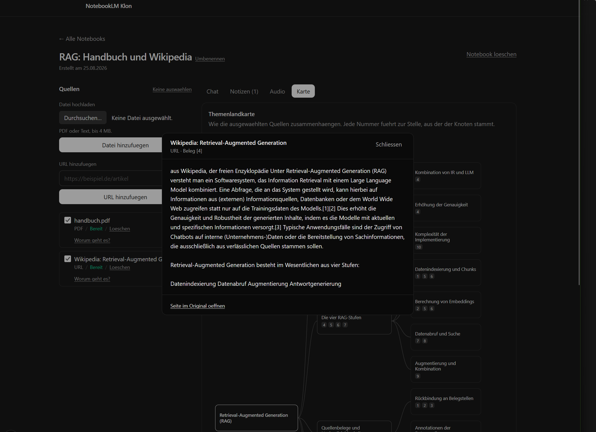
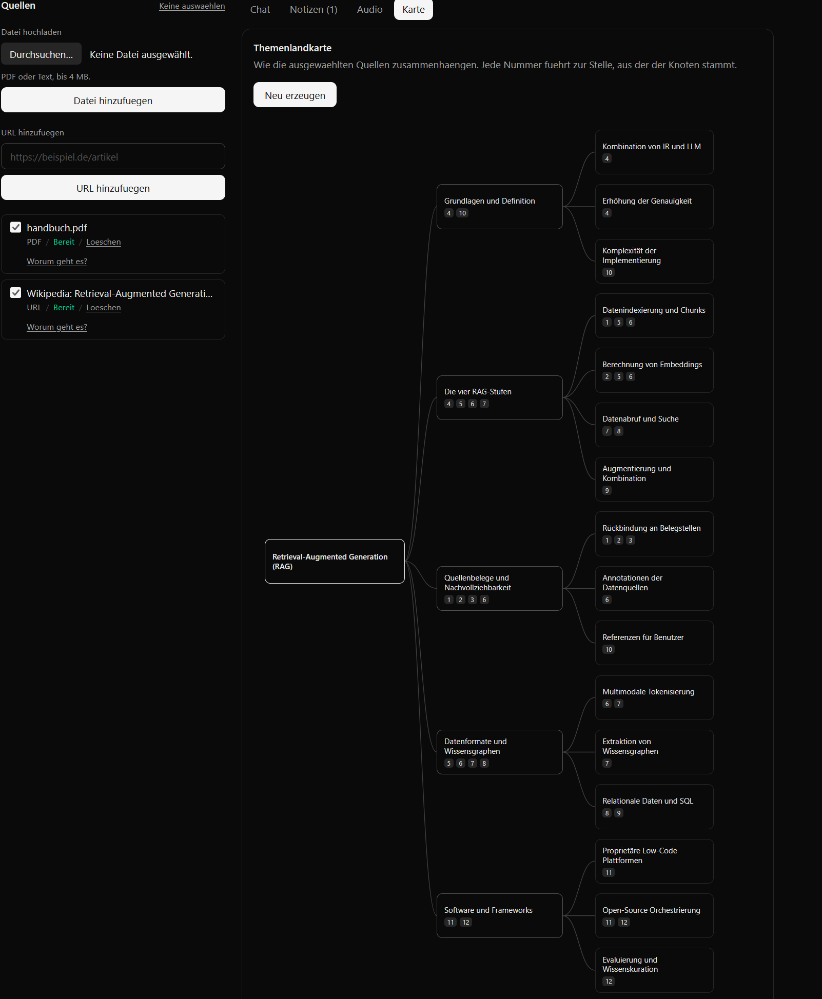

# NotebookLM Klon

Ein quellengestützter Recherche-Assistent nach Vorbild von Google NotebookLM.
Notebook anlegen, Quellen hochladen (PDF, Textdatei, URL), Fragen stellen —
**und jede Aussage der Antwort zurückverfolgen bis zur Textstelle, aus der sie
stammt.**

**Live: https://notebooklm-klon-to-kar.vercel.app**


> Bewerbungsaufgabe. Der Fokus liegt auf dem Kern des Produkts und auf
> nachvollziehbaren Entscheidungen, nicht auf Funktionsfülle.

> **Zur Live-Demo:** Notebooks, Quellen und gespeicherte Gespräche lassen sich
> jederzeit ansehen. Das Stellen *neuer* Fragen hängt am kostenlosen
> Kontingent des Anbieters — **20 Anfragen pro Tag für das gesamte Projekt**.
> Ist es aufgebraucht, meldet der Chat das ausdrücklich, statt stumm zu
> scheitern. Wer die Antwortqualität selbst prüfen möchte, startet das
> Projekt am besten lokal mit einem eigenen Schlüssel.
>
> Dieses Kontingent hat mehrere Entscheidungen im Code geformt. Die
> Einstiegsfragen etwa entstehen im selben Anbieteraufruf wie die
> Quellenbeschreibung, nicht in einem eigenen — sichtbar in
> `lib/ingestion/summarize.ts`.

## Worum es geht

Der Wert von NotebookLM liegt nicht im Chat. Ein Chat ohne Belege ist ein
Sprachmodell mit Textfeld. Der Wert liegt darin, dass **jede Aussage aus deinen
Quellen belegt ist und du das nachprüfen kannst, ohne dem Modell zu glauben.**

Konkret heißt das hier:

- Die Antwort verweist mit `[1]`, `[2]` auf die Abschnitte, aus denen sie stammt.
- Ein Klick auf die Nummer öffnet den **wörtlichen Abschnitt** — nicht eine
  Zusammenfassung davon.
- Von dort führt ein Link ins Original: bei PDFs direkt auf die richtige Seite,
  bei Web-Quellen auf die Seite.
- Findet die Suche nichts Passendes, wird das Modell **gar nicht erst gefragt**.
  Statt einer erfundenen Antwort kommt eine Absage.

Der letzte Punkt ist der wichtigste. Ein Assistent, der bei fehlendem Wissen
rät, ist schlimmer als keiner.



Derselbe Dialog öffnet sich überall, wo etwas belegt ist: im Chat, unter einer
gespeicherten Notiz und in der Themenlandkarte. Eine Belegstelle sieht immer
gleich aus, egal woher man kommt.

## Funktionsumfang

| Bereich | Was |
| --- | --- |
| Notebooks | anlegen, auflisten, öffnen, umbenennen, löschen |
| Quellen | PDF- und Textupload, URL-Eingabe, Statusanzeige, an- und abwählen, umbenennen, löschen |
| Beschreibung | Kurzfassung und Kernthemen je Quelle, direkt nach der Ingestion |
| Ingestion | Parsen, Chunking mit Herkunftsangabe, Embedding, Statuspflege |
| Chat | Retrieval, gestreamte Antwort, Folgefragen mit aufgelösten Rückbezügen |
| Einstiegsfragen | Vorschläge aus den ausgewählten Quellen, ein Klick stellt die Frage |
| Zitate | klickbare Verweise, wörtlicher Abschnitt, Link ins Original |
| Verlauf | wird gespeichert, überlebt einen Reload, lässt sich leeren |
| Notizen | Antworten sichern oder selbst schreiben; gesicherte Antworten behalten ihre Belege |
| Audio | gesprochene Zusammenfassung der ausgewählten Quellen, zwei Stimmen, rund 30 Sekunden |
| Karte | Themenlandkarte der ausgewählten Quellen; jeder Knoten belegt sich und führt in denselben Belegdialog |

### Themenlandkarte

Was in den Quellen steht, nebeneinander statt hintereinander. Jeder Knoten
trägt die Nummern der Abschnitte, aus denen er stammt, und ein Klick darauf
öffnet denselben Belegdialog wie im Chat.



Der Baum kommt als strukturierte Ausgabe vom Modell, die Anordnung dagegen aus
einer reinen Funktion in `lib/mindmap/layout.ts`: Baum rein, Koordinaten raus.
Damit lässt sich prüfen, was man bei Grafikcode sonst nur sieht — dass sich
keine zwei Kästen überlappen und keiner aus der Fläche fällt.

## Stack

- **Next.js** (App Router, TypeScript), Deployment auf Vercel
- **Supabase**: Postgres mit pgvector für die Vektorsuche, Storage für Dateien
- **Gemini** für Embeddings und Antworten — per Env austauschbar

Ein einziges Deploy-Ziel, eine echte Datenbank statt Attrappe.

## Datenfluss

```
Quelle hinzufuegen ──▶ Storage (privat)
        │
        ▼
  Ingestion: parsen ──▶ chunken ──▶ embedden ──▶ chunks (pgvector)
                          │
                          └─ jeder Chunk merkt sich Seite und Zeichenoffset

Frage ──▶ Rueckbezuege aufloesen ──▶ Vektorsuche ──▶ Kontext bauen
                                                        │
                                                        ▼
                                          Antwort streamen mit [n]
                                                        │
                                                        ▼
                                     Klick auf [n] ──▶ Abschnitt + Original
```

Die Herkunftsangabe im Chunk ist kein Beiwerk: ohne sie gäbe es keine
klickbaren Zitate und damit kein Produkt.

## Lokal starten

```bash
npm install
cp .env.example .env.local
```

**Migrationen anwenden** — alle elf, in dieser Reihenfolge, im
Supabase-SQL-Editor oder per CLI:

| Datei | Inhalt |
| --- | --- |
| `0001_init.sql` | Tabellen und `match_chunks` |
| `0002_grants.sql` | Rechte und RLS |
| `0003_sources.sql` | URL-Spalte, Constraint, Storage-Bucket |
| `0004_source_error.sql` | Fehlergrund einer Quelle |
| `0005_messages.sql` | Chatverlauf |
| `0006_source_selection.sql` | Quellenauswahl und gefiltertes Retrieval |
| `0007_source_summary.sql` | Kurzfassung und Kernthemen je Quelle |
| `0008_notes.sql` | Notizen |
| `0009_audio_overview.sql` | Gesprochene Zusammenfassung und ihr Bucket |
| `0010_mindmap.sql` | Themenlandkarte |
| `0011_source_questions.sql` | Einstiegsfragen je Quelle |

**Env-Variablen:**

| Variable | Woher |
| --- | --- |
| `NEXT_PUBLIC_SUPABASE_URL` | Supabase-Dashboard, Projektseite |
| `NEXT_PUBLIC_SUPABASE_PUBLISHABLE_KEY` | Settings ▸ API Keys ▸ Publishable |
| `SUPABASE_SECRET_KEY` | Settings ▸ API Keys ▸ Secret — **niemals in den Client** |
| `LLM_API_KEY` | [aistudio.google.com](https://aistudio.google.com/apikey) |
| `LLM_MODEL` | z. B. `gemini-3.5-flash` |
| `EMBEDDING_MODEL` | `gemini-embedding-001` |
| `SPEECH_MODEL` | optional, Standard `gemini-2.5-flash-preview-tts` |

```bash
npm run dev     # http://localhost:3000
npm test        # 135 Tests, unter einer Sekunde
npm run lint
npm run build
```

`http://localhost:3000/api/health` meldet, ob alle sechs Env-Variablen gesetzt
sind, und nennt die fehlenden beim Namen. Derselbe Endpunkt liegt auf der
Live-Demo unter `/api/health`.

> **Zur Embedding-Dimension:** `chunks.embedding` und die Signatur von
> `match_chunks` stehen auf 1536. Wer das Embedding-Modell wechselt, muss beide
> Stellen anpassen. `gemini-embedding-001` liefert auf Wunsch genau 1536, ein
> anderer Anbieter womöglich nicht. Der Code prüft die Länge und bricht ab,
> statt unbrauchbare Vektoren zu schreiben.

## Entscheidungen

Die ausführlichen Begründungen stehen in den Pull Requests. Die wichtigsten:

**Der Browser spricht nie mit Supabase.** Alle Zugriffe laufen serverseitig, der
Secret-Key bleibt auf dem Server. Rechte hat ausschließlich `service_role`;
`anon` bekommt bewusst keine, obwohl der Publishable Key im Client-Bundle liegt.

**Quellen lassen sich abwählen, und gefiltert wird in der Datenbank.** Ohne
Einschränkung verdrängt eine große Quelle eine kleine: gemessen an einem
Notebook mit 19 Chunks aus einem Artikel und 3 aus einem PDF war unter den
besten acht Treffern kein einziger aus dem PDF — die Frage nach dem PDF-Inhalt
blieb unbeantwortet. Nachträglich im Anwendungscode zu filtern hätte in genau
diesem Fall nichts übrig gelassen.

**Ein Chunk gehört immer zu genau einer Seite.** Über Seitengrenzen hinweg zu
bündeln wäre effizienter, würde aber die Seitenzahl im Zitat zur Lüge machen.

**Ohne tragfähigen Kontext wird nicht gefragt.** Liegt der beste Treffer unter
einer Mindestähnlichkeit, gibt es eine feste Absage statt eines LLM-Aufrufs.
Der Schwellwert stammt aus Messungen: passende Fragen erreichten 0,63 bis 0,83,
eine unpassende 0,50.

**Der Server ist die einzige Wahrheit über den Verlauf.** Der Browser schickt
nur die Frage. Sonst gäbe es zwei Fassungen davon, was gesagt wurde, und sie
liefen auseinander, sobald ein zweiter Tab offen ist.

**Belege werden als Momentaufnahme gespeichert**, nicht als Verweis auf `chunks`.
Ein Verweis ginge ins Leere, sobald die Quelle gelöscht wird — die Antwort
beruhte aber nun einmal auf diesem Text.

**URL-Abruf mit Adressprüfung beim Verbindungsaufbau.** Ohne Auth kann jeder
eine Adresse hinterlegen, abgerufen wird sie vom Server. Den Hostnamen zu
prüfen genügt nicht: ein unauffälliger Name kann per DNS ins private Netz
zeigen. Erst aufzulösen und dann abzurufen hat eine Lücke (DNS-Rebinding),
deshalb hängt die Prüfung in der `lookup`-Funktion und trifft die Adresse, zu
der tatsächlich verbunden wird.

## Gemessen, nicht geraten

Zahlen im Code stehen nicht auf Gefühl, sondern auf Messungen gegen die echte
API:

| Messung | Ergebnis | Konsequenz im Code |
| --- | --- | --- |
| Embedding-Kontingent | 100 Requests/Minute, jedes Batch-Element zählt einzeln | Batchgröße 100, Wartebudget 45 s, max. 200 Chunks je Quelle |
| Chat-Kontingent | **20 Anfragen pro Tag** | Folgefragen werden nur bei echtem Rückbezug umgeschrieben |
| `thinkingBudget: 0` | erstes Zeichen nach 1070 ms statt 7246 ms | im Chat aktiviert |
| Modellverfügbarkeit | `gemini-2.5-flash` für neue Nutzer gesperrt, `3.7-flash` brauchte 35–53 s | `gemini-3.5-flash` als Standard |

Die 20 Anfragen pro Tag sind die härteste Grenze des Projekts und prägen
mehrere Designentscheidungen.

## Tests

135 Tests, Laufzeit unter einer Sekunde. Bewusst nur reine Logik: kein Browser,
keine Datenbank, kein LLM. Alles andere wurde gegen die echte Instanz geprüft —
ein Test, der Supabase nachbaut, prüft am Ende nur die Attrappe.

| Datei | Was |
| --- | --- |
| `chunk.test.ts` | Vollständigkeit, Überlappung, Größengrenzen, Seitenzahlen |
| `citations.test.ts` | Segmentierung des Antworttexts, Belege ohne Quelle |
| `guards.test.ts` | Adressschemata, Hostnamen |
| `address-guard.test.ts` | private IP-Bereiche, IPv4-in-IPv6 |
| `rewrite.test.ts` | wann eine Folgefrage einen LLM-Aufruf wert ist |

**Die Tests wurden gegen echte Fehler geprüft.** Ein Test, der nicht rot werden
kann, ist wertlos. Beide Fehler, die im Chunker steckten, wurden zur Kontrolle
wieder eingebaut — die Tests wurden rot, danach wieder grün.

## KI-gestützte Arbeitsweise

Die Aufgabe sah den Einsatz von KI vor. Entscheidend war dabei nicht, dass Code
erzeugt wurde, sondern **dass jede Behauptung gegen die echte Infrastruktur
geprüft wurde, bevor sie im Repo landete.** Der Ablauf pro Arbeitspaket:

1. Plan nennen, Entscheidungen offenlegen, erst dann Code
2. Bauen — ein Arbeitspaket, ein Branch, kleine Commits
3. **Gegen die echte Instanz verifizieren**, nicht gegen Attrappen
4. Ergebnis und Trade-off im PR dokumentieren, inklusive verworfener Alternativen

Was dieser Ablauf gefunden hat — Fehler, die weder Build noch Lint gesehen
hätten:

- **Die Chunk-Überlappung griff nie.** Sie war absatzweise gebaut und übertrug
  nur Absätze unter 200 Zeichen; reale Absätze sind länger. Das hätte nicht
  gekracht, sondern still die Trefferqualität ruiniert.
- **Harte Zeilenumbrüche gingen unverändert ins Embedding** — genau das Muster,
  das jede PDF-Extraktion erzeugt.
- **Ein Eigenschaftstest, der den Fehler durchließ.** Der Testdatengenerator
  erzeugte Wiederholungen, die Prüfung ging zufällig durch. Erst die Gegenprobe
  mit wieder eingebautem Fehler machte das sichtbar.
- **`fetch` durch `node:https` ersetzt und dabei zwei Regressionen eingeschleppt:**
  fehlender User-Agent (Wikipedia antwortete mit 403) und fehlende
  gzip-Behandlung — letzteres hätte lautlos Binärmüll ins Embedding
  geschrieben.

Die Fehler stehen hier, weil sie zur Arbeit gehören. Ein Bericht, der nur
Erfolge auflistet, sagt wenig darüber, wie sorgfältig geprüft wurde.

## Bewusst weggelassen

- **Auth und Multi-User.** Für eine Demo unnötig, würde nur Zeit kosten.
- **Sehr große Dokumente.** Die Ingestion ist auf demo-taugliche Größen
  ausgelegt, damit sie in die Laufzeitgrenzen einer Serverless-Function passt.
- **Video-Overview.** Audio und Themenlandkarte stehen, Video nicht: der Kern
  hat Vorrang, und bewegtes Bild bringt hier nichts, was die Karte nicht zeigt.
- **Mehrere Gespräche je Notebook** und Export.

## Bekannte Grenzen

- **20 Chat-Anfragen pro Tag** auf der kostenlosen Stufe des Anbieters. Eine
  öffentliche Demo ist damit schnell erschöpft.
- **Die Vorprüfung beim Umschreiben von Folgefragen löst bei "das" als Artikel
  fälschlich aus.** Bewusst so belassen: der Fehlalarm kostet einen Aufruf, die
  Gegenrichtung könnte eine Folgefrage ungelöst in die Suche schicken.
- **Kein Volltextindex neben der Vektorsuche.** Bei Eigennamen und Zahlen wäre
  eine hybride Suche besser.
- **Die gesprochene Zusammenfassung dauert rund 30 Sekunden**, kein
  mehrminütiger Podcast. Skript und Sprachausgabe laufen in einer
  Serverless-Function mit 60 Sekunden Grenze; gemessen braucht die
  Sprachausgabe 0,76 Sekunden je Sekunde Audio. Für mehr bräuchte es eine
  Aufteilung in Abschnitte mit eigener Zustandsverwaltung.
- **Der Fehlergrund einer Quelle hält nur den letzten Versuch fest**, keine
  Historie.
